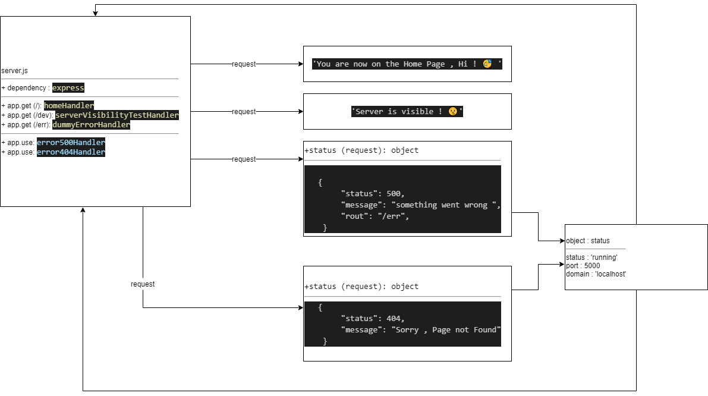

401 class 01 lab


# LAB - 01
## server-deployment-practice
### Author: Tamara Al-billeh

* [deployment for main branch ](https://tamara-server-deploy-prod.herokuapp.com/) .
* [deployment for dev branch  ](https://tamara-server-deploy-dev.herokuapp.com/) .
* [submission PR](https://github.com/tamaraalbilleh/server-deployment-practice/pulls) .
* [tests report](https://github.com/tamaraalbilleh/server-deployment-practice/actions) .
 
### Setup

#### `.env` requirements

- `PORT` - 5000

#### Running the app

- `npm start`
- Endpoint: `/`
  - Returns message

    ```

    'You are now on the Home Page , Hi ! 🥳 ';

    ```
    - Endpoint: `/dev`
  - Returns message

    ```

    'Server is visible ! 🤫';

    ```
     - Endpoint: `/err`
  - Throws an error 500
  - Returns an Object

    ```

    {
        "status": 500,
        "message": "something went wrong ",
        "rout": "/err",
    }

    ```
     - Endpoint: **anything else ..**
  - Returns an error 404
  - Returns an Object

    ```

    {
        "status": 404,
        "message": "Sorry , Page not Found"
    }

    ```
#### Tests

- Unit Tests: `npm run test`
- Lint Tests: `npm run lint`

#### UML

(Created with [diagrams](https://app.diagrams.net/))

